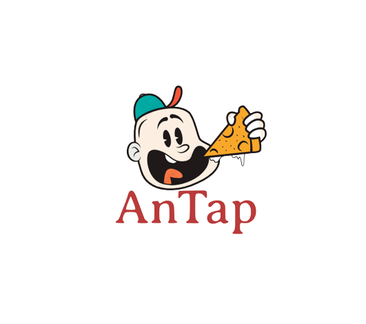
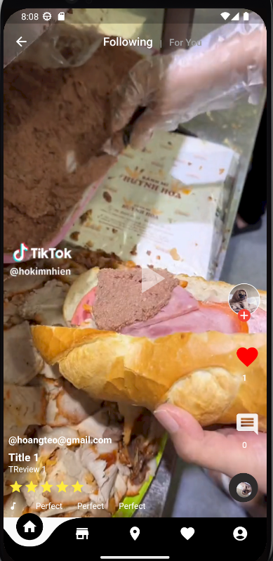
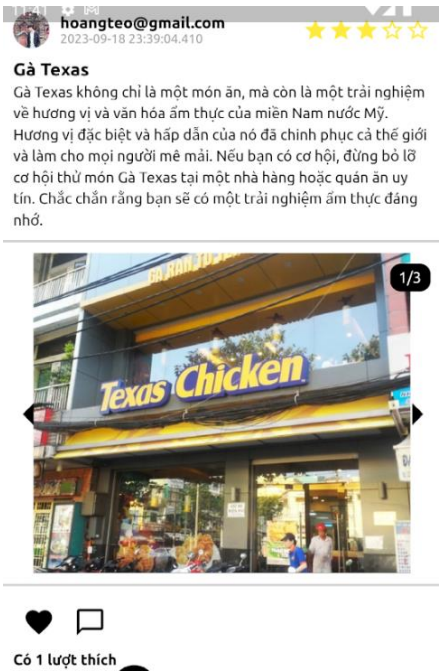
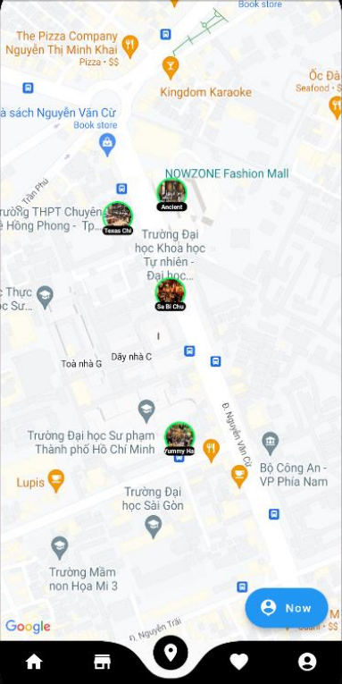
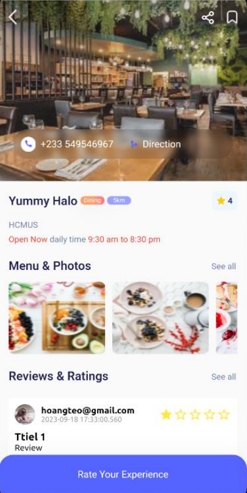
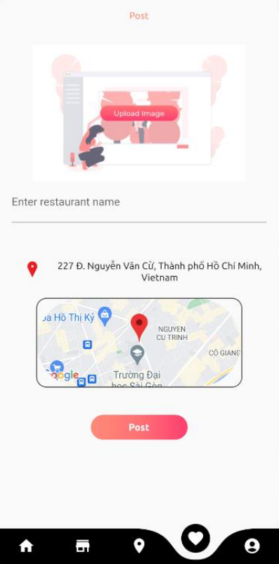

<!-- Improved compatibility of back to top link: See: https://github.com/othneildrew/Best-README-Template/pull/73 -->

<!--
*** Thanks for checking out the Best-README-Template. If you have a suggestion
*** that would make this better, please fork the repo and create a pull request
*** or simply open an issue with the tag "enhancement".
*** Don't forget to give the project a star!
*** Thanks again! Now go create something AMAZING! :D
-->

<!-- PROJECT SHIELDS -->
<!--
*** I'm using markdown "reference style" links for readability.
*** Reference links are enclosed in brackets [ ] instead of parentheses ( ).
*** See the bottom of this document for the declaration of the reference variables
*** for contributors-url, forks-url, etc. This is an optional, concise syntax you may use.
*** https://www.markdownguide.org/basic-syntax/#reference-style-links
-->

<!-- PROJECT LOGO -->
 

  
  
HCMUS

  
CS426 - Mobile Device Application Development

  

    Dang Trung Nghia
     
    Bui Nguyen Hoang
     
    Hoang Nghia Viet
     
    Tran Tuan Viet
     
    Nguyen Dinh Tung
     
  

<!-- TABLE OF CONTENTS -->

  
Table of Contents

  <ol>
    <li>
      <a href="#about-the-project">About The Project</a>
    </li>
    <li><a href="#usage">Usage</a></li>
    <li><a href="#technologies-used">Technologies used</a></li>
    <li><a href="#contact">Contact</a></li>
  </ol>

<!-- ABOUT THE PROJECT -->
## About The Project

    

AnTap is a food review application. The purpose of the application is to facilitate easier access to restaurants across the entire country for everyone. Within this app, each user can browse through restaurant review posts, which include both video and text-based content. Additionally, users can gain a comprehensive overview of all the displayed restaurants, along with their respective locations on a map. Furthermore, individuals have the capability to create and design new restaurants right at their current location. This application can be seen as a miniature social network where people can interact efficiently by posting and sharing video and text reviews of restaurants as they please.

(<a href="#readme-top">back to top</a>)

<!-- USAGE EXAMPLES -->
## Usage

### View video posts

    

- Users can like or comment on the video
- Also possible to see comments of other users and the number of likes

### View image posts

    

- Users can like or comment on the post
- Possible to see comments of other users and the number of likes
- Video post are also displayed in this section

(<a href="#readme-top">back to top</a>)

### Map

    

- In this section, a user can view a map with restaurant locations (from database) and the current location of the user.
- Can click on a restaurant in the map to see posts belonging to that restaurant and post your experience about that restaurant.

    

(<a href="#readme-top">back to top</a>)

### Check in

    

- A user can check in and create a restaurant (pin location of the restaurant on the map). The location of restaurant is the current location of user.

(<a href="#readme-top">back to top</a>)

## Technologies used

- The application is built using Flutter Framework
- Firebase Integration for Enhanced Authentication:
  - Firebase authentication is integrated to provide a secure and seamless user experience. It includes: User Login, Sign-Up Process, Forgot Password Feature
- Firestore Database Utilization:
  - Firestore, a NoSQL cloud database by Firebase, is used to store and manage various types of data, including: User Information, Restaurant Locations, Image Posts, Video Posts
- Google Maps API Integration:
  - Google Maps API is utilized to seamlessly present a map with restaurant locations. Users can easily explore nearby restaurants and plan their visits using the map feature

(<a href="#readme-top">back to top</a>)

<!-- CONTACT -->
## Contact

Dang Trung Nghia - dtnghia.forwork@gmail.com

Tran Tuan Viet - ttviet2805@gmail.com

(<a href="#readme-top">back to top</a>)

<!-- MARKDOWN LINKS & IMAGES -->
<!-- https://www.markdownguide.org/basic-syntax/#reference-style-links -->
[contributors-shield]: https://img.shields.io/github/contributors/othneildrew/Best-README-Template.svg?style=for-the-badge
[contributors-url]: https://github.com/othneildrew/Best-README-Template/graphs/contributors
[forks-shield]: https://img.shields.io/github/forks/othneildrew/Best-README-Template.svg?style=for-the-badge
[forks-url]: https://github.com/othneildrew/Best-README-Template/network/members
[stars-shield]: https://img.shields.io/github/stars/othneildrew/Best-README-Template.svg?style=for-the-badge
[stars-url]: https://github.com/othneildrew/Best-README-Template/stargazers
[issues-shield]: https://img.shields.io/github/issues/othneildrew/Best-README-Template.svg?style=for-the-badge
[issues-url]: https://github.com/othneildrew/Best-README-Template/issues
[license-shield]: https://img.shields.io/github/license/othneildrew/Best-README-Template.svg?style=for-the-badge
[license-url]: https://github.com/othneildrew/Best-README-Template/blob/master/LICENSE.txt
[linkedin-shield]: https://img.shields.io/badge/-LinkedIn-black.svg?style=for-the-badge&logo=linkedin&colorB=555
[linkedin-url]: https://linkedin.com/in/othneildrew
[product-screenshot]: images/screenshot.png
[Next.js]: https://img.shields.io/badge/next.js-000000?style=for-the-badge&logo=nextdotjs&logoColor=white
[Next-url]: https://nextjs.org/
[React.js]: https://img.shields.io/badge/React-20232A?style=for-the-badge&logo=react&logoColor=61DAFB
[React-url]: https://reactjs.org/
[Vue.js]: https://img.shields.io/badge/Vue.js-35495E?style=for-the-badge&logo=vuedotjs&logoColor=4FC08D
[Vue-url]: https://vuejs.org/
[Angular.io]: https://img.shields.io/badge/Angular-DD0031?style=for-the-badge&logo=angular&logoColor=white
[Angular-url]: https://angular.io/
[Svelte.dev]: https://img.shields.io/badge/Svelte-4A4A55?style=for-the-badge&logo=svelte&logoColor=FF3E00
[Svelte-url]: https://svelte.dev/
[Laravel.com]: https://img.shields.io/badge/Laravel-FF2D20?style=for-the-badge&logo=laravel&logoColor=white
[Laravel-url]: https://laravel.com
[Bootstrap.com]: https://img.shields.io/badge/Bootstrap-563D7C?style=for-the-badge&logo=bootstrap&logoColor=white
[Bootstrap-url]: https://getbootstrap.com
[JQuery.com]: https://img.shields.io/badge/jQuery-0769AD?style=for-the-badge&logo=jquery&logoColor=white
[JQuery-url]: https://jquery.com 
